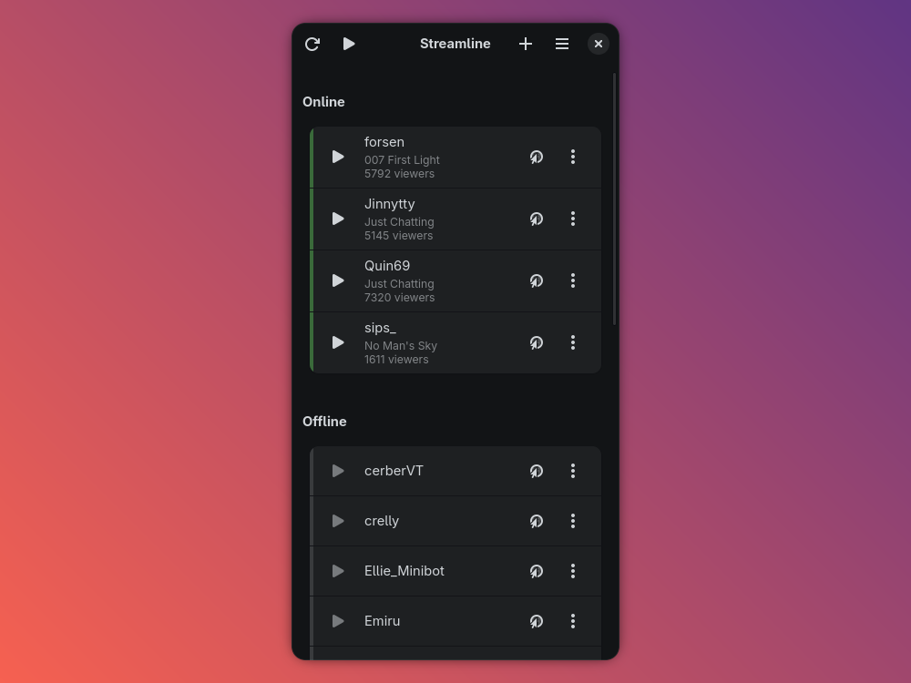

<p align="center">
  
</p>

<h1 align="center">Streamline</h1>

<p align="center">
  <strong>Watch Twitch streams in your local media player</strong>
</p>

<p align="center">
  <a href="https://github.com/jfsen/Streamline/blob/main/COPYING"></a>
  <a href="https://github.com/jfsen/Streamline/releases"></a>
</p>

---

Streamline is a GTK4/libadwaita application that lets you follow your favorite Twitch streamers, check their online status, and watch them in your preferred media player — **mpv**, **VLC**, or any custom player — all without a web browser. It also supports browsing and playing channel VODs, all powered by [Streamlink](https://streamlink.github.io/).

## Features

- **Follow streamers** — Add and unfollow Twitch streamers with a simple dialog
- **Live status** — See who's online and who's offline at a glance
- **Stream playback** — Watch live streams via Streamlink with mpv, VLC, or any custom player
- **VOD browser** — Browse and play past broadcasts (VODs) from followed channels
- **Quick Play** — Watch a one-off stream without following the channel
- **Quality presets** — Choose from High, Medium, Low, or set a custom quality string
- **Low-latency streaming** — Enable low-latency mode for faster playback
- **Custom themes** — Pick from Dark, Light, Bronze, Anthracite, and Red
- **Export** — Save your streamer list to a text file

## Screenshots

<p align="center">
  
</p>

## Installation

### Dependencies

#### Runtime

- Python 3
- [Streamlink](https://streamlink.github.io/install.html)
- A media player (mpv, VLC, or similar)
- GTK 4 and libadwaita
- PyGObject (`python-gobject` / `python3-gi`)
- `python-requests` and `python-pillow`
- Twitch API credentials (Client ID and Secret)

#### Build

- `meson`
- `desktop-file-utils`
- `appstream-glib` (or `appstreamcli`)

#### Install dependencies by distro

**Arch Linux**
```bash
sudo pacman -S --needed meson python python-gobject gtk4 libadwaita \
  python-requests python-pillow streamlink mpv desktop-file-utils appstream-glib
```

**Debian / Ubuntu**
```bash
sudo apt install meson python3 python3-gi python3-gi-cairo gir1.2-gtk-4.0 \
  gir1.2-adw-1 python3-requests python3-pillow streamlink mpv desktop-file-utils appstream
```

**Fedora**
```bash
sudo dnf install meson python3 python3-gobject gtk4 libadwaita \
  python3-requests python3-pillow streamlink mpv desktop-file-utils appstream-glib
```

> WebKit-based chat (optional): install `webkitgtk-6.0` (Arch) / `gir1.2-webkit-6.0` (Debian) / `webkitgtk6.0` (Fedora).

### Build and install (system-wide)

```bash
git clone https://github.com/jfsen/Streamline.git
cd Streamline
meson setup builddir --prefix=/usr --wipe
meson compile -C builddir
sudo meson install -C builddir
sudo glib-compile-schemas /usr/share/glib-2.0/schemas/
```

### Uninstall

```bash
sudo ninja -C builddir uninstall
```

Or remove the installed files manually:

```bash
sudo rm -f /usr/bin/streamline
sudo rm -rf /usr/share/streamline
sudo rm -f /usr/share/applications/org.jfsen.Streamline.desktop
sudo rm -f /usr/share/metainfo/org.jfsen.Streamline.metainfo.xml
sudo rm -f /usr/share/glib-2.0/schemas/org.jfsen.Streamline.gschema.xml
sudo rm -f /usr/share/dbus-1/services/org.jfsen.Streamline.service
sudo rm -rf /usr/share/icons/hicolor/*/apps/org.jfsen.Streamline*
sudo rm -f /usr/share/locale/*/LC_MESSAGES/org.jfsen.Streamline.mo
```

### Flatpak

A Flatpak manifest is included in the repository. Build and install with:

```bash
flatpak-builder --user --install --force-clean build-dir org.jfsen.Streamline.json
```

## Usage

On first launch, Streamline will prompt you for your Twitch API credentials. You can obtain these from the [Twitch Developer Console](https://dev.twitch.tv/console).

### Keyboard shortcuts

| Shortcut              | Action             |
| --------------------- | ------------------ |
| <kbd>Ctrl</kbd>+<kbd>N</kbd>  | Follow a streamer  |
| <kbd>Ctrl</kbd>+<kbd>P</kbd>  | Quick Play         |
| <kbd>Ctrl</kbd>+<kbd>R</kbd> / <kbd>F5</kbd> | Refresh stream list |
| <kbd>Ctrl</kbd>+<kbd>,</kbd>  | Preferences        |
| <kbd>Ctrl</kbd>+<kbd>Q</kbd>  | Quit               |

## Configuration

All preferences are available under **Preferences** (<kbd>Ctrl</kbd>+<kbd>,</kbd>):

- **Player** — mpv, VLC, or a custom player executable
- **Stream quality** — High, Medium, Low, or Custom.
  When set to *Custom*, you can enter a [Streamlink stream type](https://streamlink.github.io/cli.html#cmdoption-stream-types) string.
  Examples: `best` (default), `1080p60`, `720p,720p60`, `audio_only`, `worst`.
- **Theme** — System, Light, Dark, Bronze, Anthracite, Red
- **Low latency** — Toggle low-latency stream playback
- **Export streamers** — Save your followed channels to a text file

## License

Streamline is free software licensed under the [GNU General Public License v3.0 or later](COPYING).

## Credits

Created by [jfsen](https://github.com/jfsen).

Powered by [Streamlink](https://streamlink.github.io/), the [Twitch API](https://dev.twitch.tv/docs/api/), and [libadwaita](https://gnome.pages.gitlab.gnome.org/libadwaita/).
